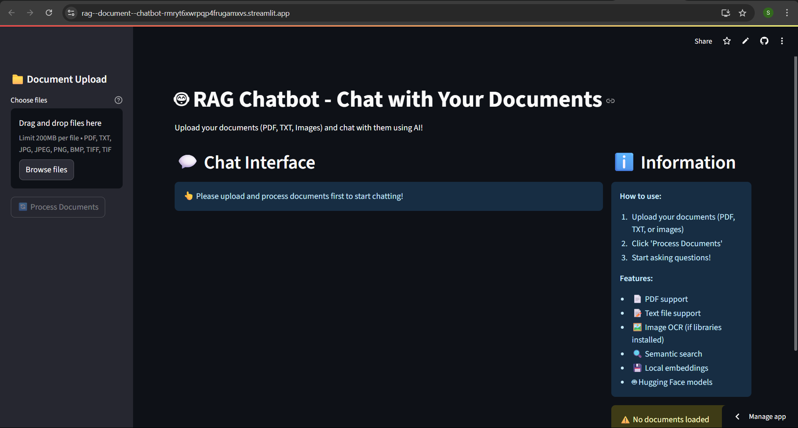

# 🤖 RAG Chatbot - Chat with Your Documents



## 🚀 Live Demo

**Try the live app:** [RAG Document Chatbot](https://rag--document--chatbot-rmryt6xwrpqp4frugamxvs.streamlit.app/)

A fully free Retrieval-Augmented Generation (RAG) chatbot application built with Streamlit and Hugging Face models. Upload documents (PDF, TXT, images) and chat with their contents using AI, completely free and running locally for embeddings.

## ✨ Features

- 📄 **PDF Support**: Upload and process PDF documents
- 📝 **Text File Support**: Process TXT files
- 🖼️ **OCR Support**: Extract text from images (JPG, PNG, TIFF, BMP)
- 🔍 **Semantic Search**: Find relevant information using vector similarity
- 💾 **Local Embeddings**: Uses local Sentence Transformers model (no API costs)
- 🤖 **Hugging Face LLM**: Powered by Falcon 7B Instruct model
- 💬 **Interactive Chat**: Conversational interface with memory
- 📚 **Source Citations**: See which documents informed the AI's response
- 🆓 **Completely Free**: No OpenAI API costs

## 🏗️ Architecture

- **Frontend**: Streamlit web interface
- **Embeddings**: `sentence-transformers/all-mpnet-base-v2` (runs locally)
- **Vector Database**: FAISS for efficient similarity search
- **Language Model**: `tiiuae/falcon-7b-instruct` via Hugging Face Hub
- **Document Processing**: LangChain with support for PDF, TXT, and OCR
- **Framework**: LangChain for RAG pipeline and conversation management

## 📋 Prerequisites

### Required Software

1. **Python 3.8+**
2. **Poppler for Windows** (for PDF processing):
   - Download from: https://github.com/oschwartz10612/poppler-windows/releases/
   - Extract and add `bin` folder to your system PATH
3. **Tesseract OCR** (for image processing):
   - Download from: https://github.com/UB-Mannheim/tesseract/wiki
   - Install and add to system PATH

### Hugging Face Account

- Create a free account at https://huggingface.co/
- Generate an API token at https://huggingface.co/settings/tokens
- Set the token as an environment variable (see setup instructions below)

## 🚀 Installation

### Step 1: Clone/Download the Project

The project is already set up in:
```
C:\Users\user\OneDrive\Desktop\work\projects\rag-chatbot\
```

### Step 2: Create Virtual Environment

```bash
cd "C:\Users\user\OneDrive\Desktop\work\projects\rag-chatbot"
python -m venv venv
venv\Scripts\activate
```

### Step 3: Install Dependencies

```bash
pip install -r requirements.txt
```

### Step 4: Set Up Environment Variables

1. **Copy the example environment file:**
```bash
copy .env.example .env
```

2. **Edit the .env file** and add your Hugging Face token:
```
HUGGINGFACE_API_TOKEN=hf_your_actual_token_here
```

**Alternative: Set environment variable directly (Windows):**
```bash
set HUGGINGFACE_API_TOKEN=hf_your_actual_token_here
```

### Step 4: Install Additional Windows Dependencies

#### Install Poppler for PDF Processing

1. Download Poppler for Windows from: https://github.com/oschwartz10612/poppler-windows/releases/
2. Extract to `C:\poppler` (or your preferred location)
3. Add `C:\poppler\Library\bin` to your system PATH:
   - Press `Win + R`, type `sysdm.cpl`, press Enter
   - Click "Environment Variables"
   - Under "System Variables", find "Path" and click "Edit"
   - Click "New" and add `C:\poppler\Library\bin`
   - Click OK to save

#### Install Tesseract OCR (Optional for Image Processing)

1. Download Tesseract from: https://github.com/UB-Mannheim/tesseract/wiki
2. Install to default location (`C:\Program Files\Tesseract-OCR`)
3. Add `C:\Program Files\Tesseract-OCR` to your system PATH

### Step 5: Verify Installation

Test if Poppler is correctly installed:
```bash
pdftoppm -h
```

Test if Tesseract is correctly installed (optional):
```bash
tesseract --version
```

## 🎯 Usage

### Starting the Application

1. Navigate to the project directory:
```bash
cd "C:\Users\user\OneDrive\Desktop\work\projects\rag-chatbot"
```

2. Activate the virtual environment:
```bash
venv\Scripts\activate
```

3. Run the Streamlit app:
```bash
streamlit run app.py
```

4. Open your browser to `http://localhost:8501`

### Using the Chatbot

1. **Upload Documents**: Use the sidebar to upload PDF, TXT, or image files
2. **Process Documents**: Click "Process Documents" to create embeddings
3. **Start Chatting**: Ask questions about your documents in the main interface
4. **View Sources**: Expand the "Source Documents" section to see which parts of your documents informed the AI's response

### Example Queries

- "What is the main topic of this document?"
- "Summarize the key points"
- "What does the document say about [specific topic]?"
- "List the important dates mentioned"
- "Who are the main people discussed?"

## 📁 Project Structure

```
rag-chatbot/
├── app.py                 # Main Streamlit application
├── requirements.txt       # Python dependencies
├── README.md             # This file
└── .gitignore           # Git ignore patterns (if using git)
```

## 🔧 Configuration

### Modifying the Language Model

To use a different Hugging Face model, edit the `repo_id` in `app.py`:

```python
self.llm = HuggingFaceHub(
    repo_id="microsoft/DialoGPT-large",  # Change this
    huggingfacehub_api_token=self.hf_token,
    model_kwargs={
        "temperature": 0.7,
        "max_length": 512,
        "max_new_tokens": 200
    }
)
```

### Modifying the Embedding Model

To use a different embedding model, change the model name:

```python
self.embeddings = HuggingFaceEmbeddings(
    model_name="all-MiniLM-L6-v2",  # Change this
    model_kwargs={'device': 'cpu'}
)
```

### Adjusting Chunk Settings

Modify document chunking parameters:

```python
self.text_splitter = RecursiveCharacterTextSplitter(
    chunk_size=1500,      # Increase for larger chunks
    chunk_overlap=300,    # Increase for more overlap
    length_function=len
)
```

## 🐛 Troubleshooting

### Common Issues

1. **"poppler not found" error**:
   - Ensure Poppler is installed and added to PATH
   - Restart your command prompt/terminal after adding to PATH

2. **OCR not working**:
   - Install Tesseract OCR and add to PATH
   - The app will still work without OCR for PDF and TXT files

3. **Slow model loading**:
   - First run will be slower as models are downloaded
   - Subsequent runs will be faster

4. **Memory issues**:
   - Reduce chunk_size in text splitter
   - Process fewer documents at once

5. **Hugging Face API errors**:
   - Check your internet connection
   - Verify the API token is valid
   - Some models may have rate limits

### Performance Tips

- **First Run**: Models will be downloaded (can take several minutes)
- **CPU Usage**: Embedding generation uses CPU - be patient with large documents
- **Memory**: Close other applications if running low on RAM
- **Document Size**: Very large documents may take time to process

## 📝 License

This project is open source and available under the MIT License.

## 🤝 Contributing

Feel free to submit issues, feature requests, or pull requests to improve the application.

## 📞 Support

If you encounter issues:

1. Check this README for troubleshooting steps
2. Ensure all prerequisites are properly installed
3. Check the Streamlit logs for detailed error messages
4. Verify your Hugging Face API token is valid

## 🎉 Acknowledgments

- **Streamlit** for the web framework
- **Hugging Face** for the models and transformers
- **LangChain** for the RAG framework
- **FAISS** for efficient vector similarity search
- **Sentence Transformers** for embeddings

---

**Happy chatting with your documents! 🚀**
